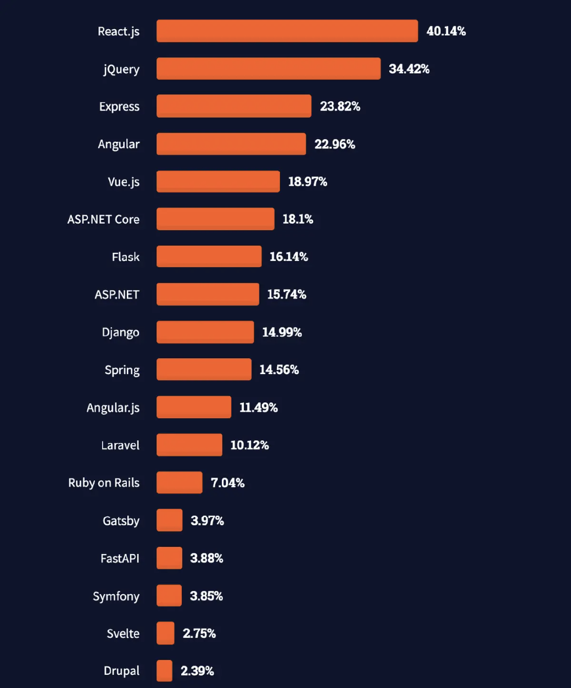

# What is React ?



-   React is a library to create user interfaces
-   React is used to build single-page applications(SPA).
-   React allows us to create reusable components.

## How to create a React project ?

-   `create-react-app` :

```bash
npx create-react-app my-app
```

-   `vite` :

```bash
npm create vite@latest
```

## How does React works?

React creates a VIRTUAL DOM in memory. Instead of manipulating the browser's DOM directly,
React creates a virtual DOM in memory, where it does all the necessary manipulating, before making the changes in the browser DOM.
React finds out what changes have been made, and changes only what needs to be changed.

`React V17 VS VS18`

```js
// Before, more compatible
import ReactDOM from 'react-dom';
ReactDOM.render(<App />, document.getElementById('root'));

// After more performance and Concurrent Mode
import ReactDOM from 'react-dom/client';
const root = ReactDOM.createRoot(document.getElementById('root'));
root.render(<App />);
```

## What is jsx?

JSX stands for JavaScript XML.
JSX allows us to write HTML in React.
JSX makes it easier to write and add HTML in React.

## What is a component ?

it is a function which return `jsx` , reuseable part of UI, it could be small as a button or large as a page

## How to create your components?

```jsx
const Button = () => {
    return <button>I'm a button</button>;
};

const App = () => {
    return (
        <div>
            <h1>Welcome to my app</h1>
            <Button />
        </div>
    );
};

export default App;
```

## Props

Props are arguments passed into React components.
NOTE : React Props are read-only! You will get an error if you try to change their value.

```jsx
const Button = ({ text, clickHandler }) => {
    return <button onClick={clickHandler}>{text}</button>;
};

const App = () => {
    const clickHandler = () => {
        console.log('I am clicked');
    };

    return (
        <div>
            <h1>{num}</h1>
            <Button text='I am a button' clickHandler={clickHandler} />
        </div>
    );
};
```

## style your component

```jsx
const Button = () => {
    return <button className='btn'>I'm a button</button>;
};
```

```css
.btn {
    padding: 20px;
    border: 2px solid black;
    border-radius: 50%;
}
```

## Displaying data in jsx

```jsx
const User = () => {
    const userData = {
        name: 'Jack',
        age: 20,
    };
    return (
        <div>
            <p>my name is {userData.name}</p>
            <p>My age is {userData.age}</p>
        </div>
    );
};

export default User;
```

## add dynamic styling

```jsx
const Student = () => {
    const studentData = {
        name: 'Sara',
        age: 19,
        font: 'font-family: Georgia, serif;',
    };
    return (
        <div style={{ fontFamily: studentData.font }}>
            <p>my name is {studentData.name}</p>
            <p>My age is {studentData.age}</p>
        </div>
    );
};

export default Student;
```

## conditional rendering

```jsx
const Dog = () => {
    const isNice = true;
    return (
        <div>
            {isNice && <p>You are nice dog 👍</p>}
            {!isNice && <p>You are not a nice dog 👎</p>}
        </div>
    );
};

export default Dog;
```

## rendering a list

The JavaScript map() array method is generally the preferred method.
Keys allow React to keep track of elements. This way, if an item is updated or removed,
only that item will be re-rendered instead of the entire list.

```jsx
const Names = () => {
    const names = [
        { title: 'Cabbage', id: 1 },
        { title: 'Garlic', id: 2 },
        { title: 'Apple', id: 3 },
    ];

    return <ul>{names.map(name) => <li>{name.title}</li>}</ul>;
};

export default Names;
```

## events

```jsx
const Button = () => {
    const clickHandler = () => {
        console.log('Hi from React');
    };
    return <button onClick={clickHandler}>I'm a button</button>;
};
```

## Handle form

This will work as normal, the form will submit and the page will refresh.
But this is generally not what we want to happen in React.
We want to prevent this default behavior and let React control the form.

```jsx
import { useState } from 'react';
const MyForm = () => {
    const [name, setName] = useState('');
    const submitHandler = (e) => {
        e.preventDefault();
        alert(`The name you entered was: ${name}`);
    };
    return (
        <form onSubmit={(e) => submitHandler(e)}>
            <label>
                Enter your name:
                <input
                    type='text'
                    value={name}
                    onChange={(e) => setName(e.target.value)}
                />
            </label>
        </form>
    );
};
```

## useState

The React useState Hook allows us to track state in a function component.
State generally refers to data or properties that need to be tracking in an application.

useState accepts an `initial stat`e and returns two values:

-   The current state.
-   A function that updates the state.

if your state is an object or an an array
When state is updated, the entire state gets overwritten.

```jsx
import { useState } from 'react';
const FavoriteColor = () => {
    const [color, setColor] = useState('red');

    return (
        <>
            <h1>My favorite color is {color}!</h1>
            <button type='button' onClick={() => setColor('blue')}>
                Blue
            </button>
        </>
    );
};

const Car = () => {
    const [car, setCar] = useState({
        brand: 'Ford',
        model: 'Mustang',
        year: '1964',
        color: 'red',
    });

    const updateColor = () => {
        setCar((previousState) => {
            return { ...previousState, color: 'blue' };
        });
    };

    return (
        <>
            <h1>My {car.brand}</h1>
            <p>
                It is a {car.color} {car.model} from {car.year}.
            </p>
            <button type='button' onClick={updateColor}>
                Blue
            </button>
        </>
    );
};
```

## Projects

1. counter
2. Calculator
3. To Do App
4. Snapshot
5. E Commerce h3
